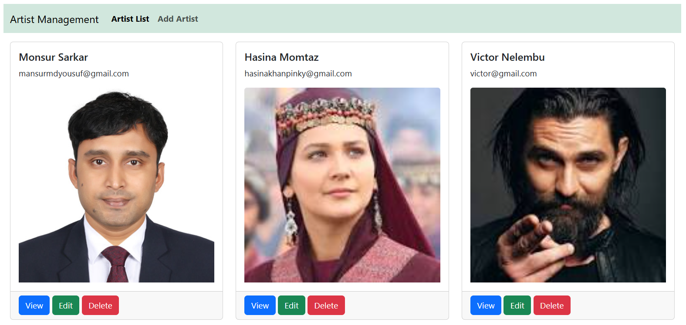
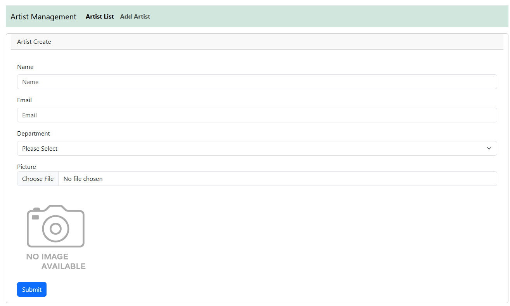
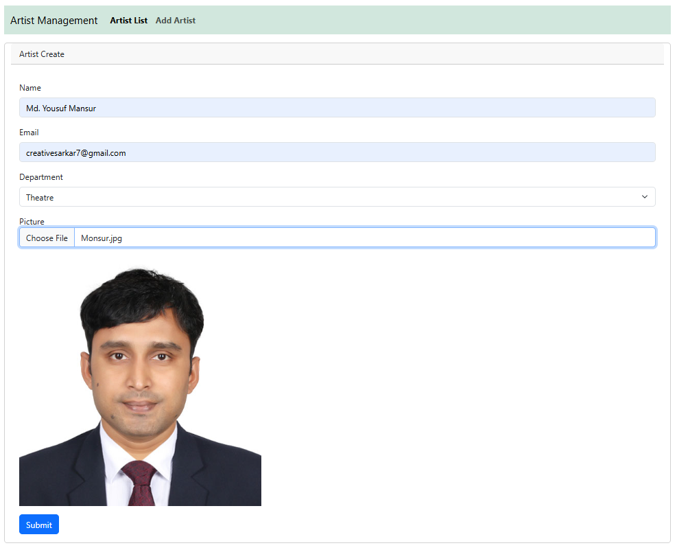
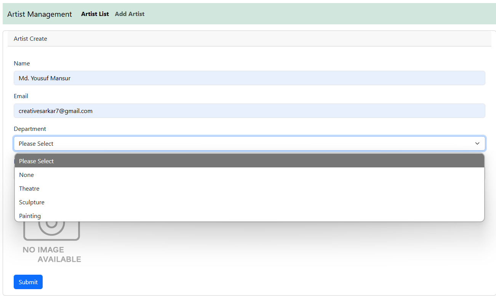
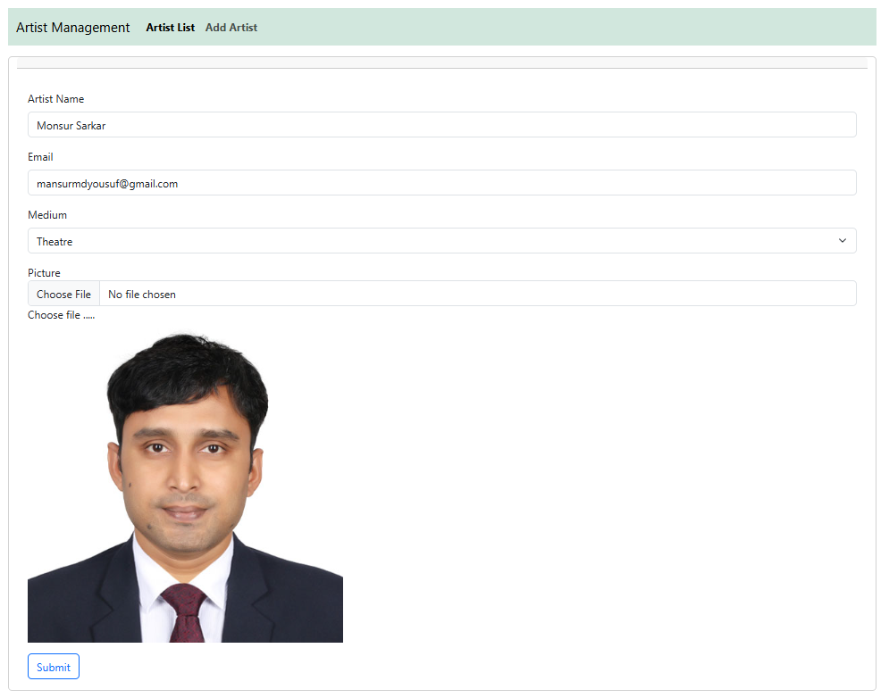

---

# Core MVC Web App for Artist Management (CRUD with Repository Pattern)

This project is a Single Entity CRUD (Create, Read, Update, Delete) application built with ASP.NET Core MVC 8.0 (LTS) using the Repository Pattern. It demonstrates how to perform CRUD operations efficiently using modern web technologies.

## Features

- ASP.NET Core 8 MVC framework (LTS)
- Repository Pattern for better separation of concerns
- Entity Framework Core for data access
- jQuery and Ajax for asynchronous operations
- Bootstrap for responsive design

## Prerequisites

- .NET Core SDK 8 (Long-Term Support)
- Visual Studio 2022 or later / Visual Studio Code
- SQL Server

## Installation

1. Clone the repository:
   
   ```bash
   git clone https://github.com/yousuf-mansur/core-mvc-artist-management-repository-pattern.git
   ```

2. Open the project in Visual Studio:
   - Open the `.sln` file in Visual Studio.

3. Restore NuGet packages (if necessary):
   - Go to **Tools > NuGet Package Manager > Package Manager Console**.
   - Run the following command to restore the packages:
     
     ```bash
     dotnet restore
     ```

4. Set up the database:
   - In the Package Manager Console, run the following command to apply the migrations and create the database:
     
     ```bash
     Update-Database
     ```

## Running the Application

1. Press `F5` or click the Start button in Visual Studio to run the application.
2. The application will open in your default web browser.

## Images View

### List of Artist
 
  
### Insert Blank Page


### Insert Master Data


### Drop-down list for insert


### Update view



## Usage

You can now perform CRUD operations on the master-details entities. The application uses jQuery Ajax to asynchronously handle details data operations, providing a smooth user experience.

## Project Structure

- `Controllers/` - Contains the MVC controllers for handling requests and responses.
- `Models/` - Contains the Entity Framework Core models and DbContext.
- `Views/` - Contains the views for rendering HTML.
- `wwwroot/` - Contains static files like CSS, JavaScript, and images.

## Technologies Used

- ASP.NET Core 8 (LTS)
- Entity Framework Core
- jQuery
- Ajax
- Bootstrap
- SQL Server

## Contributing

1. Fork the repository.
2. Create your feature branch (`git checkout -b feature/AmazingFeature`).
3. Commit your changes (`git commit -m 'Add some AmazingFeature'`).
4. Push to the branch (`git push origin feature/AmazingFeature`).
5. Open a pull request.

## About Me

I am Md. Yousuf Mansur, a full-stack developer specializing in web application development. My skills include:

- ASP.NET MVC and ASP.NET Core
- Angular and React for front-end development
- Entity Framework and Entity Framework Core
- SQL Server database management
- RESTful APIs and Web Services
- JavaScript, jQuery, and Ajax

My journey in software development began in 2023 with an IsDB-BISEW scholarship. I have completed my IsDB-BISEW IT scholarship course at Star Computer Systems Limited.

With a year of experience in web development, I am proficient in modern technologies and methodologies, enabling me to develop a wide range of web applications.

- Contact me for your project
- E-mail: mansurmdyousuf@gmail.com
- WhatsApp: +880 1719983377
- LinkedIn: [Md. Yousuf Mansur](https://www.linkedin.com/in/md-yousuf-mansur/)

---

